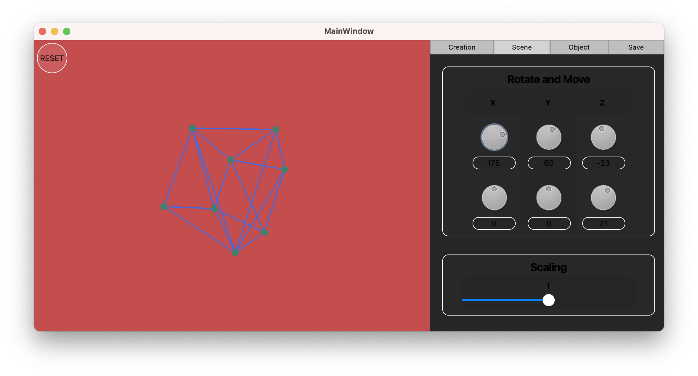

# 3D-Viewer
В данном проекте реализована программа для просмотра 3D моделей в каркасном виде (3D Viewer). Модели загружаются из файлов формата .obj и просматриваются на экране с возможностью вращения, масштабирования и перемещения.
